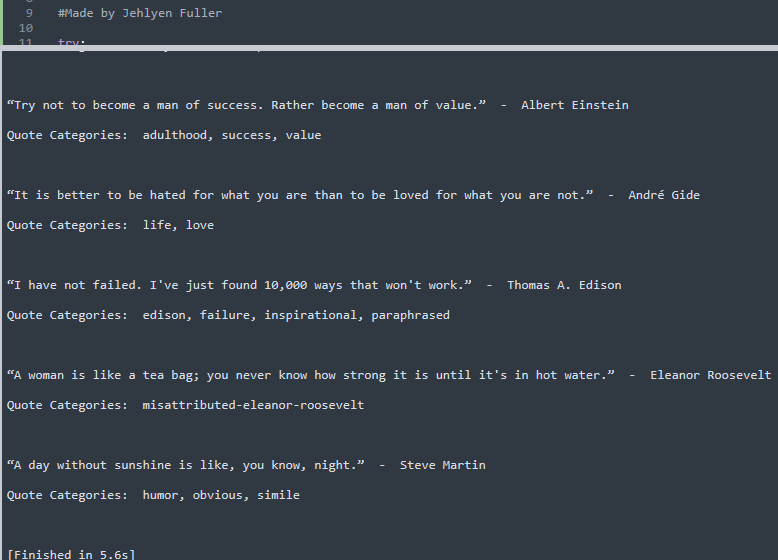
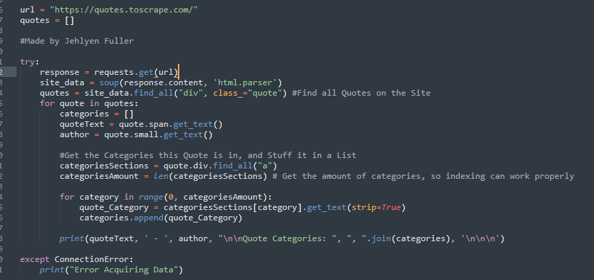

# 📜 Quotes Web Scraper & Data Structurer

**Author:** Jehlyen Fuller
**Tech Stack:** Python, Requests, BeautifulSoup, Pandas

---

## 🚀 Overview

This project is a **Python-based web scraping tool** that dynamically extracts **inspirational quotes**, their **authors**, and their **categories** from [Quotes to Scrape](https://quotes.toscrape.com/).
The scraper is built with **robust error handling**, clean code structure, and produces **analysis-ready datasets** for further processing or integration into applications.

---

## ✨ Features

* **Dynamic Extraction:**
  Pulls quote text, author names, and associated categories from HTML elements.
* **Error Handling:**
  Implements network failure handling to ensure reliable execution.
* **Data Structuring:**
  Stores results in a clean `pandas` DataFrame for export and analysis.
* **Category Organization:**
  Ensures per-quote category separation and avoids data duplication.
* **Extensible Design:**
  Can be expanded to handle pagination and scrape all available pages.

---

## 🛠 Technologies Used

* **Python 3**
* [Requests](https://docs.python-requests.org/en/master/) – For HTTP requests
* [BeautifulSoup4](https://www.crummy.com/software/BeautifulSoup/) – For HTML parsing
* [Pandas](https://pandas.pydata.org/) – For structured data handling

---

## 📂 Project Structure

```
quotes_scraper/
│
├── quotes_scraper.py       # Main scraping script
├── README.md               # Project documentation
└── sample_output.csv       # Example output
```

---

## 🔍 How It Works

1. **Send a GET request** to the target URL with `requests`.
2. **Parse the HTML** using BeautifulSoup.
3. **Locate each quote** (`div.quote`) and extract:

   * Quote text
   * Author name
   * Categories (tags)
4. **Append results** to a Python dictionary for DataFrame conversion.
5. **Output** to console or save to CSV.

---

## 💻 Example Output

**Console Example:**

```
“Try not to become a man of success. Rather become a man of value.”  -  Albert Einstein
Quote Categories: adulthood, success, value
```

**DataFrame Example:**

| Quote                                   | Author          | Categories                |
| --------------------------------------- | --------------- | ------------------------- |
| “Try not to become a man of success...” | Albert Einstein | adulthood, success, value |

---

## 📸 Screenshots

**Execution & Output:**


**Code:**


---

## 📦 Installation & Usage

1. Clone the repository:

   ```bash
   git clone https://github.com/fullajeh/QuotesScraper.git
   cd QuotesScraper
   ```
   ```
2. Run the scraper:

   ```bash
   python QuotessScraper.py
   ```

---

## 🔮 Future Improvements

* Add **pagination** to scrape all pages automatically.
* Implement **CSV/JSON export** with CLI arguments.
* Add **retry logic** with backoff for network issues.
* Deploy as an **API endpoint** to serve quotes on demand.

---

## 🤝 Contributing

Pull requests are welcome!
If you’d like to suggest features, open an issue.
Connect with me on LinkedIn at: https://www.linkedin.com/in/jehlyen-fuller-83bb89323/

---

